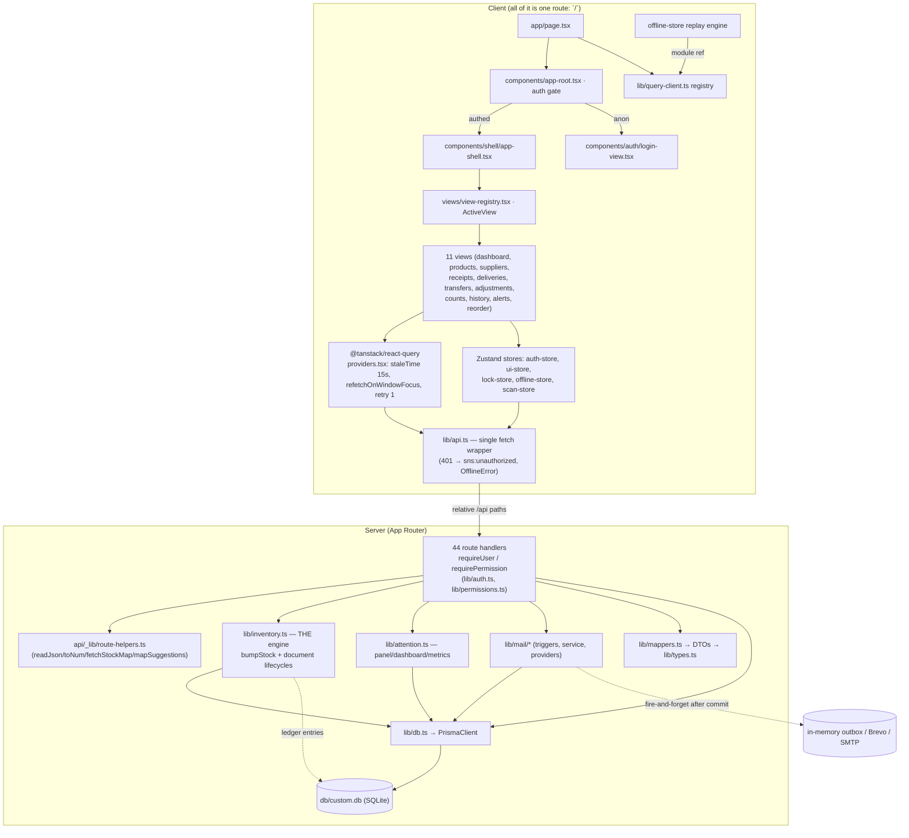

# StockSense — Architecture Review (`ARCH-*`)

**Repo**: `D:\Github\Odoo-StockSence` · **branch**: `main` (uncommitted work in tree — nothing was switched, stashed, committed or reverted)
**Reviewer mode**: read-only System Design / Architecture pass (skill: `senior-architect`)
**Date**: 2026-10-05
**Scope**: `src/app`, `src/lib`, `src/components`, `src/stores`, `prisma/schema.prisma`, `next.config.ts`, `package.json`, `tests/`, `scripts/`, deploy artifacts.

---

## 0. Method & confidence

Everything below was read directly or produced by a read-only command. Commands executed:

| Check | Command / tool | Result |
|---|---|---|
| Circular dependencies | `dependency_analyzer.py . --check circular` (senior-architect skill) | `No circular dependencies found.` |
| Layering | `project_architect.py . --check layers` | `No layer violations found.` |
| Type gate | `npx tsc --noEmit` | **exit 0** (run by this reviewer) |
| Engine/ledger invariants | `npm test` (read-only SQLite, `readOnly: true`) | **16/16 pass** (run by this reviewer) |
| Live schema vs indexes | `npx prisma db pull --print` | **zero `@@index` entries in the live DB** |
| Auth coverage sweep | every `route.ts` scanned for `requireUser`/`requirePermission`/`getSessionUser` | 35 of 44 routes authed; 9 do not authenticate (see ARCH-001/002) |
| Mutation sweep | `grep stockLevel\.(update\|upsert\|create\|delete)` | **1 hit**: `src/lib/inventory.ts:139` |
| Transaction sweep | `grep \$transaction` | 16 stock/document-mutating routes |

**Not verified (marked `UNVERIFIED` in-line):** runtime behaviour of the standalone bundle (DB path resolution), whether the `Caddyfile` is actually deployed, whether the Brevo API key in git history is still live, and any *measured* performance numbers — no performance targets or benchmarks exist in the repo (`ai/current-state.md:86`), so every performance finding below is **structural (complexity-based), not measured**.
This review did **not** run the dev server or send a single mutating HTTP request.

---

## 1. Architecture map

### 1.1 Physical layout (measured)

| Area | Files | Lines |
|---|---:|---:|
| `src/**` (ts/tsx) | 199 | 25,133 |
| API route handlers `src/app/api/**/route.ts` | 44 | 2,199 |
| Views `src/components/views/**` | 50 | 9,900 |
| shadcn/ui primitives `src/components/ui/**` | 48 | — |
| Inventory engine `src/lib/inventory.ts` | 1 | 817 |
| Aggregations `src/lib/attention.ts` | 1 | 300 |

### 1.2 Component & dependency map

### 1.3 Request flows

**Write flow (must hold for every stock change):**
`route.ts` → `requirePermission(...)` → parse/validate (`readJson`/`toNum`) → `db.$transaction(tx => EngineFn(tx, ...))` → engine `getStock → compute next → refuse <0 → stockLevel.upsert → ledgerEntry.create` → commit → *then* read-back for DTO → **then** (optionally) fire-and-forget mail trigger → JSON.

**Read flow:** `route.ts` → auth → full-table `findMany` (+ `include`s) → map to DTO in process → optional **in-process** filter/sort/slice → JSON.
There is no repository layer: route handlers call `db.*` directly for reads and delegate only *writes* to the engine.

**View flow:** hash `#view=key` ↔ `useUIStore` (`ui-store.ts:38-44`, `66-78`) → `ActiveView` remounts on key change (`view-registry.tsx:40-47`) → each view owns its `useQuery` keys → mutations invalidate ad-hoc key lists.

### 1.4 Route inventory (44 handlers)

- **Unauthenticated (9)**: `auth/{login,logout,me,otp,reset-password}`, `health`, **`mail/{inbox,digest,low-stock}`** ← see ARCH-001/002.
- **Session-only**: `ledger/export` (manual check at `ledger/export/route.ts:21-22`).
- **Permission-gated**: everything else (`receive`, `pick`, `pack`, `transfer`, `count`, `adjust`, `approve-adjustment`, `approve-reorder`, `configure` — `permissions.ts:9-19`).

---

## 2. Data model review

**Schema**: `prisma/schema.prisma` (372 lines, 23 models). **Live DB**: `db/custom.db` (224 KB, tracked by git).

### 2.1 What is sound

- All relations are declared with explicit `fields`/`references`; document line tables (`ReceiptLine`, `DeliveryLine`, `TransferLine`, `AdjustmentLine`, `CycleCountLine`) use `onDelete: Cascade`, so documents cannot orphan lines.
- Every natural key is constrained: `Product.sku`, `Supplier.name`, `StockLevel(productId,locationId)`, `Receipt/DeliveryOrder/Transfer/Adjustment/CycleCount/LedgerEntry .code`, `ReorderSuggestion.productId`, `Session.token`, `ProductSupplier(productId,supplierId)`.
- The ledger is genuinely append-only *by construction*: only `bumpStock` writes both `StockLevel` and `LedgerEntry`, and it records `prevQty` from a value read inside the same transaction (`inventory.ts:116,138-162`). Chain continuity, `diff === newQty − prevQty`, and tail-equals-`StockLevel` are asserted by `tests/unit/ledger-reconcile.test.mjs:45-99` — **re-run by this reviewer: 16/16 pass**.
- Products have no `DELETE` route (`products/[id]/route.ts` exposes GET+PATCH only) → no accidental cascade destruction of ledger history. Supplier deletion is history-guarded (`suppliers/[id]/route.ts:240-258`).

### 2.2 Defects & gaps → findings

| Observation | Evidence | Finding |
|---|---|---|
| **Zero secondary indexes** anywhere (only unique constraints) | `prisma/migrations/0_init/migration.sql:308-353` (all `CREATE UNIQUE INDEX`); live DB via `prisma db pull --print` → no `@@index` | ARCH-003 |
| Status columns are free `String`s, comments are the only contract | `schema.prisma:180,205,230,254,308,347,361` | ARCH-006 (one live drift, one latent in dead code) |
| `ReorderSuggestion.preferredName` stores a supplier **name** and is used as a lookup key | `schema.prisma:344`, `inventory.ts:858`, `_lib/route-helpers.ts:68-71` — rename allowed by `suppliers/[id]/route.ts:134-142` | ARCH-011 |
| Count↔adjustment relation is a **substring match on `reason`**; `ExceptionFlag.refType/refId` is polymorphic with no FK | `schema.prisma:251-263,364-366`; `counts/route.ts:12-20`; `counts/[id]/submit/route.ts:38-41`; `inventory.ts:544` | ARCH-010 |
| `LedgerEntry.docCode` and `Location.fullPath` are denormalised with no maintenance path | `schema.prisma:286,82` | ARCH-010 / ARCH-028 (latent) |
| Derived quantities are **stored** (`StockLevel.*`) | `schema.prisma:153-167` | ADR-001/ADR-002 — reconciled by ledger, single writer, tested |
| Append-only ledger is unbounded and re-scanned to mint codes | `inventory.ts:53-63` | ARCH-012 |

---

## 3. Findings

Severity: **CRITICAL > HIGH > MEDIUM > LOW**. Every finding carries file + line evidence, impact, and a recommendation.

### ARCH-001 — CRITICAL — Unauthenticated `/api/mail/inbox` returns password-reset OTPs (account takeover)

**Evidence**
- `src/app/api/mail/inbox/route.ts:6-9` — `GET` handler calls `mailService.getRecentEmails()` with **no** `requireUser`/`requirePermission`/`getSessionUser`.
- `src/app/api/auth/otp/route.ts:36-39` — a reset request stores the OTP **and** calls `mailService.sendOtpEmail(user.email, user.name, otpCode)`.
- `src/lib/mail/service.ts:62-67` — the OTP email **subject contains the raw code**: ``subject: `[StockSense] Password Reset Verification Code: ${otpCode}` ``.
- `src/lib/mail/provider.ts:5-6,16-19,82-88,103-105` — both `ConsoleEmailProvider` (default) and `BrevoEmailProvider` (selected because `.env` sets `BREVO_API_KEY`) keep every sent mail in an in-memory outbox and expose `getInbox()`.
- `src/app/api/auth/reset-password/route.ts:34-62` — code + new password → `user.update({passwordHash})` + all sessions destroyed.
- No global gate exists: glob `**/middleware.ts` → **0 files**; `src/app` contains only `page.tsx`, `layout.tsx`, `providers.tsx`, `globals.css`, `api/`.
- The UI exposes the inbox to every signed-in user (`components/shell/topbar.tsx:17,188`; `mail-inbox-sheet.tsx:48-57`), but that is irrelevant — the endpoint itself is open.

**Impact**: unauthenticated → `POST /api/auth/otp {email}` → `GET /api/mail/inbox` → read code from `subject` → `POST /api/auth/reset-password` → **full account takeover of any user, including `INVENTORY_MANAGER` (which holds every permission, `permissions.ts:31`)**. The OTP is valid for 10 minutes (`otp-store.ts:22`), long enough to be practical. This defeats the entire custom-auth design.

**Recommendation**: add `requireUser()` (or at minimum an explicit dev-only gate on `OTP_DEBUG`) to `mail/inbox`, `mail/digest`, `mail/low-stock`; never place a secret in a stored subject line; add a regression test asserting 401 on all three routes. This is the single fix that most raises the security posture of the app.

---

### ARCH-002 — HIGH — Unauthenticated state-changing mail endpoints disclose data and act as an open relay

**Evidence**
- `src/app/api/mail/digest/route.ts:8-45` — no auth; queries manager emails (lines 13-17), dispatches mail (line 31) and **returns `recipients`** (line 44).
- `src/app/api/mail/low-stock/route.ts:8-30` — no auth; triggers outbound alerts (line 10) and returns `lowStockCount` + `lowStockSkus` (lines 28-29).
- Both are `POST` handlers reachable cross-origin (cookie-less); no `middleware.ts` (ARCH-001 evidence).

**Impact**: anonymous caller can (a) harvest every manager's email address, (b) read which SKUs are below reorder point (commercially sensitive), (c) trigger unlimited outbound email to internal users (mail-bombing / relay abuse, amplification because one call loops products at `mail/triggers.ts:103-119`).

**Recommendation**: gate both behind `requirePermission('configure')`; make them idempotent (`POST` with an audit row) and rate-limited. Never return recipient lists from an unauthenticated surface.

---

### ARCH-003 — HIGH — Zero secondary indexes on hot query columns

**Evidence**
- `prisma/migrations/0_init/migration.sql:308-353` — every index statement is `CREATE UNIQUE INDEX`; **no plain `CREATE INDEX` exists**.
- Confirmed against the **live** database: `npx prisma db pull --print` → `@@unique` only (4 composite uniques), **zero `@@index`**.
- Hot predicates/orderings that therefore table-scan:
  - `LedgerEntry.createdAt` — `attention.ts:175-177` (`gte`), `ledger/route.ts:39` (`orderBy createdAt desc, id desc`), `ledger/export/route.ts:51-55`.
  - `LedgerEntry.docType/productId/locationId` — `ledger/route.ts:29-31`, `attention.ts:195-199`.
  - `ExceptionFlag.status + createdAt` — `attention.ts:28`.
  - `StockLevel.locationId` — `inventory.ts:662`; the composite unique `(productId, locationId)` has `productId` leading, so a location-only predicate cannot use it.
  - `AdjustmentLine.productId/locationId/delta` + joined `Adjustment.createdAt/status` — `inventory.ts:524-531`.
  - `Receipt/DeliveryOrder/Transfer/CycleCount.status` counters — `attention.ts:27,34-36,138,141`.

**Impact**: at the current 224 KB database every scan is trivial (honest caveat), but `LedgerEntry` is **append-only and unbounded** — every quantity-field change writes ≥1 row (`inventory.ts:144-162`). Scan cost on the dashboard/history/export paths therefore grows linearly forever, and it grows *inside write transactions* too (ARCH-012).

**Recommendation**: add `@@index` for `LedgerEntry(createdAt)`, `LedgerEntry(productId, locationId)`, `LedgerEntry(docType, createdAt)`, `ExceptionFlag(status, createdAt)`, `StockLevel(locationId)`, `AdjustmentLine(productId, locationId)`, `Receipt(status, expectedAt)`, `DeliveryOrder(status)`, then `prisma db push`. Cheap, no semantic change.

---

### ARCH-004 — HIGH — Whole-table reads with filter/sort/pagination performed in process

**Evidence**
- `src/app/api/ledger/route.ts:38-56` — loads **every** ledger row (`findMany` with no `take`), filters `q` in JS (46-52), computes `total = filtered.length` (54), then `slice(offset, offset+limit)` (56).
- `src/app/api/products/route.ts:28-52` — all products + includes, then JS `filter` (41-44) and JS `sort` (47-52).
- `src/app/api/counts/route.ts:14,27-30` — loads **all** adjustments to string-match count codes, all counts, filters in JS.
- `src/app/api/adjustments/route.ts:19-23`, `transfers/route.ts:21`, `deliveries/route.ts:21`, `receipts/route.ts:21-22` — same pattern.
- `src/app/api/meta/route.ts:13-18` — warehouses + locations + suppliers + products-with-stocks in one call.
- Server has no pagination contract; `limit/offset` are cosmetic (work is done before slicing).

**Impact**: cost per request is O(table size × join size) regardless of `limit`; the ledger endpoint is the worst because its table is unbounded (ARCH-003/012). Payload sizes are unbounded too (a warehouse with 10k SKUs ships the whole catalogue for every dialog that queries `['products']`, `app-shell.tsx:127-131`).

**Recommendation**: push `where`/`orderBy`/`take`/`offset` into Prisma for ledger, counts, adjustments; make `q` a SQL predicate (SQLite `LIKE`, or FTS5 if search matters); keep summary aggregates in a single SQL `GROUP BY` instead of JS reduce. Treat the DTO contract as versioned so clients can adopt cursor paging incrementally (see ADR-005 — do not reverse silently).

---

### ARCH-005 — HIGH — Secrets and environment: a live API key is in git history; no secret-management story

**Evidence**
- `.env:3` — `BREVO_API_KEY` (real-looking key present in the working tree; value deliberately not reproduced here).
- `git log --oneline --all -- .env` → committed in **3 commits** (`39eceac`, `67b12f7`, `6dbd226`); `.gitignore` now has `.env*` and `git status` shows `D  .env` (staged deletion) — the file leaves the tree, **but the key stays in history**.
- `.env:6` — `OTP_DEBUG=1` in the working copy (returns `debugOtp` from `POST /api/auth/otp`, `auth/otp/route.ts:12,41`). Correctly gated per `ai/decisions.md` D-QA-11, but it is *on* in this tree.
- `.env` is also copied into the production artifact: `.next/standalone/.env` (observed in the build output listing).

**Impact**: anyone with repo read access (or a leaked build artifact) can send mail as the application and read its Brevo logs; combined with ARCH-001 the OTP debug flag is a second, independent takeover path if this tree is ever deployed as-is.

**Recommendation**: **rotate the Brevo key now** (history rewrite will not un-leak it), scrub secrets from history with `git filter-repo`/BFG, keep `OTP_DEBUG` out of any deployed tree, and document a `.env.example` with placeholders. Add a pre-commit secret scan (gitleaks) — there is no CI today (ARCH-015).

---

### ARCH-006 — MEDIUM — Free-string status fields with no enum → one live and one latent status-enum drift

**Evidence**
- **Live bug** — `prisma/schema.prisma:205` — `DeliveryOrder.status // RESERVED | PICKED | PACKED | DELIVERED | CANCELLED`.
  `src/app/api/mail/digest/route.ts:27` — `db.deliveryOrder.count({ where: { status: { in: ['DRAFT','PICKED','PACKED'] } } })`. `DRAFT` is not a delivery status at all and `RESERVED` (every order not yet picked) is invisible → `pendingDeliveries` in the daily digest mail is systematically under-counted. The correct set exists at `src/lib/mail/triggers.ts:135` (`['RESERVED','PICKED','PACKED']`), 100 lines away.
- **Latent (dead code)** — `prisma/schema.prisma:308` — `CycleCount.status // OPEN | COMPLETED | CANCELLED`.
  `src/lib/mail/triggers.ts:136` — `db.cycleCount.count({ where: { status: { in: ['SCHEDULED','COUNTING'] } } })` → **always 0**, so `openFlags: openCounts` at `triggers.ts:166` would permanently report 0. Verified this pass: `triggerDailyDigest` (`triggers.ts:128`) has **no importer anywhere** in `src/`, `tests/` or `scripts/` — the shipped digest is `mail/digest/route.ts:31` → `mailService.sendDailyDigest`, which takes `openFlags` from `attention.summary.openFlags` (correct). This drift therefore does not affect production output *today*; it fires the moment someone wires `triggerDailyDigest` up.
- The two code paths compute the same metric differently and share no constant.

**Impact**: the live digest reports a wrong `pendingDeliveries` (operational reporting silently understates work in the queue); the dead path carries a second, independent wrong status set that no test or type checks. No compile-time or DB-level guard exists, and the correct/incorrect copies sit ~100 lines apart so they will drift again. Root cause: status is an unconstrained `String` (`schema.prisma:180,205,230,254,308,347,361`) — SQLite has no native enums and Prisma enums are unavailable on SQLite.

**Recommendation**: fix `mail/digest/route.ts:27` now (use `['RESERVED','PICKED','PACKED']`); either delete `triggerDailyDigest` or make it import the same shared query helper so it cannot drift again. Define status literal unions + `zod` enums in one shared module (e.g. `src/lib/status.ts`), use it in every `where` and mapper, and add a unit test asserting each union member appears in the schema comment set.

---

### ARCH-007 — MEDIUM — A read endpoint performs non-transactional writes (and can revert an accepted suggestion)

**Evidence**
- `src/app/api/reorder/route.ts:15-24` — `GET` calls `await refreshSuggestions(db)` **on every request**, passing the *global* client (default param `refreshSuggestions(tx: Tx = db)`, `inventory.ts:806`), i.e. each statement auto-commits separately — **not** inside `db.$transaction`, contrary to the engine rule at `worklog.md:12`.
- Read-then-write inside it: existing row read at `inventory.ts:817`, upsert payload built at `836-845` — and that payload includes `status:'PENDING', decidedBy:null, decidedAt:null, receiptCode:null`.
- `acceptSuggestion` (inside its own transaction, `reorder/[id]/accept/route.ts:32`) sets `status:'ACCEPTED'` + `receiptCode` (`inventory.ts:869-872`).

**Impact**: (a) side-effectful `GET` — any prefetch, refetch-on-focus (`providers.tsx:17`), health probe or crawler mutates data; (b) a lost-update window: if `refreshSuggestions` reads a suggestion as `PENDING` (line 817) and a manager accepts it before the upsert (line 846), the suggestion is **reverted to `PENDING` with `receiptCode` wiped**, while the receipt it created already exists. The window is small (two awaits) but real, and `GET /api/reorder` fires often.

**Recommendation**: move the refresh into a `POST /api/reorder/refresh` (or run it inside `db.$transaction` with a status guard `updateMany({ where: { status: 'PENDING' } })`); make the upsert never touch decision columns (`data` should not reset `decidedBy/decidedAt/receiptCode/status` for an existing row).

---

### ARCH-008 — MEDIUM — Read-then-write checks outside transactions (uniqueness/existence)

**Evidence**
- `products/route.ts:101-102` SKU uniqueness checked, then create at `111` (different unit of work) → concurrent duplicate yields Prisma P2002 → generic 500 (`products/route.ts:147`) instead of a 400.
- `suppliers/route.ts:95-98` case-insensitive name uniqueness computed **in JS over all rows**, create at `118`. SQLite `UNIQUE` is case-sensitive, so `Acme` vs `acme` can both be inserted concurrently; the guard is advisory only.
- `suppliers/[id]/route.ts:129-130` existence check, transaction starts at `185`.
- `products/[id]/route.ts:49-50` existence check, transaction starts at `91`.
- `attention/flags/[id]/review/route.ts:16-23` — `findUnique` → status check → `update`, no transaction (benign today: both writers write identical values, but it is the same anti-pattern).

**Impact**: mostly cosmetic today (DB constraints are the real backstop), but errors surface as 500s, the case-insensitive supplier rule is unenforceable, and the pattern is exactly the one the project forbids for stock (`worklog.md:12`) — it is simply tolerated for metadata.

**Recommendation**: move existence/uniqueness checks *inside* the transaction, catch `P2002` and map to 400 in a shared handler (ARCH-014), and store supplier names normalised (or `COLLATE NOCASE`) if case-insensitive uniqueness is a real rule.

---

### ARCH-009 — MEDIUM — `PATCH /api/products/[id]` silently destroys per-supplier economics

**Evidence**
- `products/[id]/route.ts:91-107`: when `supplierIds` is supplied, `tx.productSupplier.deleteMany({ where: { productId: id } })` (94) followed by `createMany` with `costPrice: 0, minOrderQty: 0, orderMultiple: 1, preferred: i===0` (96-105).
- The *other* writer treats the same relation as a partial upsert preserving economics: `suppliers/[id]/route.ts:187-221` (`costPrice`/`minOrderQty`/`orderMultiple`/`preferred` preserved per link).
- Client impact today: only `new-product-dialog.tsx:96` sends `supplierIds` (on `POST`), so the destructive path is **latent** — reachable by any API consumer and by a future UI change.

**Impact**: silently resetting `costPrice`/MOQ/order multiple corrupts reorder suggestions (`inventory.ts:828-834` uses `minOrderQty`/`orderMultiple`) and preferred-supplier selection; data loss with no error and no audit entry.

**Recommendation**: make product PATCH *diff* links (upsert changed, delete only removed ids, never recreate untouched rows), or forbid `supplierIds` on PATCH and route all link edits through `/api/suppliers/[id]`. Add an e2e assertion that economics survive a product patch.

---

### ARCH-010 — MEDIUM — Cross-document relationships encoded as free text and polymorphic refs

**Evidence**
- `Adjustment` has no FK to `CycleCount` (`schema.prisma:251-263`); the link is created by embedding the count code in a sentence: `inventory.ts:544` (`${input.reason} (cycle count ${sourceCountCode})`).
- It is then *read back* by substring scan: `counts/route.ts:12-20` (`adjustments.filter(a => (a.reason ?? '').includes(c))` over **all** adjustments) and `counts/[id]/submit/route.ts:38-41` (`reason: { contains: row.code }`).
- `ExceptionFlag.refType/refId/refCode` is a hand-rolled polymorphic reference with no FK (`schema.prisma:364-366`); `LedgerEntry.docCode` likewise (`schema.prisma:286`).

**Impact**: O(all adjustments) scans per counts page; the relationship breaks if a reason is ever reworded, and a count code that is a substring of another (`CNT-4` vs `CNT-42`) can produce false matches. Referential integrity cannot be enforced or cascaded.

**Recommendation**: add `Adjustment.sourceCountId Int?` + relation (nullable, so non-count adjustments stay valid); keep `reason` purely human. Keep `LedgerEntry.docCode` free (it is an *immutable audit* reference — that part is deliberate, see ADR-005), but filter counts/adjustment joins on the FK.

---

### ARCH-011 — MEDIUM — Denormalised `preferredName` used as a lookup key breaks on supplier rename

**Evidence**
- `schema.prisma:344` — `ReorderSuggestion.preferredName String` (snapshot of a supplier name).
- `inventory.ts:858` — `tx.supplier.findUnique({ where: { name: s.preferredName } })` when converting an accepted suggestion into a receipt → renamed supplier ⇒ `supplierId: null` on the receipt.
- `_lib/route-helpers.ts:68-71` — suggestion DTO joins MOQ/order-multiple by `` `${productId}:${s.preferredName}` `` → after a rename the link silently disappears (`minOrderQty` falls back to 0/1).
- Renames are permitted: `suppliers/[id]/route.ts:134-142`.

**Impact**: silent degradation of reorder economics and receipt provenance after an ordinary admin action; no error, no test covers it.

**Recommendation**: store `preferredSupplierId Int?` (+ `@@unique([productId])` unchanged) and derive the display name at read time; keep `preferredName` only as a cached label, never as a key.

---

### ARCH-012 — MEDIUM — O(n) code generation inside write transactions; untested under parallel success

**Evidence**
- `inventory.ts:37-51` — `nextDocCode` runs `findMany({ select: { code: true } })` over **all** rows of a document type, parses every code in JS, takes max.
- `inventory.ts:53-63` — `nextLedgerCode` does `findMany({ code: { startsWith: prefix } })`, i.e. all ledger codes of the year.
- `inventory.ts:144-162` — it is awaited **once per changed field, per line, inside the transaction** (`code: await nextLedgerCode(tx, ctx.at)` at line 147).
- Correctness is protected by `code String @unique` (`schema.prisma:175,203,229,253,284,307`), but the failure mode under contention is an exception, not a retry.

**Impact**: every stock mutation re-scans a table that only ever grows (append-only ledger), while holding the SQLite write lock — quadratic total cost as history accumulates. Under two *simultaneously successful* creates the max-scan can race → unique violation / `SQLITE_BUSY` surfaced as a generic 500 (`route.ts` catch-alls).
`UNVERIFIED`: I did not find any test that drives **parallel successful** document creation — `tests/e2e/concurrency.test.mjs:71-78` sizes the probe so exactly one request passes the availability check *before* `nextDocCode` runs (`inventory.ts:289-303` precedes `304`), so the code-generation race is not exercised. Whether it ever surfaces in practice is therefore unverified.

**Recommendation**: replace with a per-year counter row (`UPDATE ... SET n = n + 1 RETURNING n`) or `SELECT max` on an indexed column (`ORDER BY id DESC LIMIT 1`), and add an e2e probe that fires N *individually-unsatisfiable-free* creates in parallel and asserts every 2xx has a unique code and no 5xx.

---

### ARCH-013 — MEDIUM — OTPs and the mail outbox live in process memory

**Evidence**
- `src/lib/auth/otp-store.ts:13` — `const otpStore = new Map<string, StoredOtp>()`, 10-minute TTL (`:22`), attempt cap (`:16,41-48`).
- `src/lib/mail/provider.ts:5-6,45-46` — `private readonly outbox: StoredEmail[]` capped at 100; also the low-stock debounce map `mail/service.ts:13-14`.
- `ai/current-state.md:99` acknowledges: "The in-memory mail inbox resets whenever the dev server restarts."

**Impact**: restart ⇒ all pending OTPs invalid (user must re-request — tolerable) **and** the audit/inbox view is lost (not tolerable if anyone relies on it). Horizontally scaling to two instances splits OTP state (a code issued by instance A cannot be verified by instance B) and splits the inbox. It also means ARCH-001's leak window is bounded by restarts rather than policy.

**Recommendation**: persist OTPs (hashed, with `expiresAt`/`attempts`) in the existing `Session`-style tables, and persist sent mail if the inbox is a product feature; if it is a dev tool, gate it behind `OTP_DEBUG`/admin permission instead. Note this constraint is coupled to the SQLite single-instance decision (ADR-005 risk).

---

### ARCH-014 — MEDIUM — Inconsistent API error contract + 44× duplicated try/catch

**Evidence**
- The generic contract (log server-side, return `{error:'Internal error'}`) is repeated verbatim in ~40 handlers, e.g. `products/route.ts:55-59`.
- Two exceptions leak internals: `mail/digest/route.ts:47` `return NextResponse.json({ error: errorMsg }, { status: 500 })` and `mail/low-stock/route.ts:32` (same) — this is exactly the regression QA-007 closed elsewhere.
- `ledger/export/route.ts:90-92` swallows `HttpError` and always returns 500 (loses 400/401 fidelity).
- There is no `withRoute()` wrapper in `api/_lib/route-helpers.ts` (66 lines: only parsing helpers).

**Impact**: error handling drifts per author (three different behaviours exist today); internal messages reach clients on the mail routes; adding logging/metrics/trace-ids means editing 44 files.

**Recommendation**: one `routeHandler(fn)` wrapper that maps `HttpError → status`, logs, and normalises 500s; delete the per-route blocks. Fix the two mail routes immediately (info-leak).

---

### ARCH-015 — MEDIUM — Build-time type gate disabled, no CI to compensate

**Evidence**
- `next.config.ts:6-8` — `typescript: { ignoreBuildErrors: true }`.
- `tsconfig.json:13` — `"noImplicitAny": false` (weakens an otherwise `strict: true` config, `:11`).
- `next.config.ts:9` — `reactStrictMode: false`.
- No `.github/`, no `Dockerfile`, no `vercel.json` (checked: all absent) → nothing runs `lint`/`tsc`/`test`/`build` automatically (`ai/known-issues.md:40-42` agrees: BLK-01/QA-002 residual).
- Mitigating fact (verified by this reviewer): `npx tsc --noEmit` **currently exits 0**, and `npm test` passes 16/16.

**Impact**: the type contract between `lib/types.ts` DTOs and 44 handlers is enforced only by a manual habit; `ignoreBuildErrors` means a type error ships to production silently. `reactStrictMode: false` removes the double-effect detector that would catch non-idempotent `useEffect`s (the prefetch/interval effects in `app-shell.tsx:125-131` and `offline-replay.ts:97-110` are exactly the kind that benefit).

**Recommendation**: remove `ignoreBuildErrors`, flip `noImplicitAny` on (fix the fallout incrementally), turn StrictMode back on, and add a minimal CI workflow running `lint && tsc --noEmit && npm test && npm run build`.

---

### ARCH-016 — MEDIUM — Schema evolution via `db push --accept-data-loss` with an orphaned migration

**Evidence**
- `package.json:14` — `"db:push": "prisma db push --accept-data-loss"`; `:16-17` define `db:migrate`/`db:reset` which are not used (`prisma/migrations/` contains only `0_init`).
- `git status` shows the live DB itself as modified (` M db/custom.db`) → schema and data travel together in one file.

**Impact**: `--accept-data-loss` means a schema edit can silently drop columns/rows; with `0_init` as a *parallel, non-authoritative* artifact, a fresh environment cannot be provisioned from migrations alone (it would replay a migration that no longer matches `schema.prisma`). There is no record of *what* changed between deployments.

**Recommendation**: pick one source of truth. Either (a) create a real migration for every schema change (`prisma migrate dev`) and drop `--accept-data-loss` from the default script, or (b) declare `db push` official **and** delete `prisma/migrations/` so nobody mistakes it for a working baseline. Document the choice (would be ADR-006).

---

### ARCH-017 — MEDIUM — The SQLite database is version-controlled and has no backup story

**Evidence**
- `git ls-files db prisma` → `db/custom.db` is **tracked**; `git status` → ` M db/custom.db`.
- No backup/restore script anywhere (`grep -i backup` over `scripts/`, `docs/`, `ai/` → 0 hits); no `docker/`, no CI, no scheduled job.
- Single file, 224 KB, holding sessions, users, stock and the full ledger.

**Impact**: (a) every data change pollutes diffs/PRs and merges can silently regress data to an older binary; (b) a corrupted/truncated file loses everything — there is no WAL/backup verification, no `VACUUM`/integrity plan, no restore drill; (c) contributors who "reset" the file destroy in-flight work (already observed: `ai/known-issues.md:23-30` QA-008).

**Recommendation**: `git rm --cached db/custom.db` (keep `.gitkeep`), add `db/*.db*` to `.gitignore`, and provide a tiny backup script (`sqlite3 .backup` or file copy while stopped) plus a documented restore path. Keep seed data reproducible instead (`prisma/seed.ts` already exists — make it non-destructive, QA-008).

---

### ARCH-018 — MEDIUM — Deployment bundle omits Prisma schema/migrations and the database

**Evidence**
- `next.config.ts:4` — `output: "standalone"`; `package.json:7-8` — build runs `scripts/copy-standalone.mjs`, start runs `bun .next/standalone/server.js`.
- `scripts/copy-standalone.mjs:30-31` copies **only** `.next/static` and `public/`.
- Observed `.next/standalone` contents: `.next`, `node_modules`, `public`, `.env`, `package.json`, `server.js` — **no `prisma/`, no `db/`**.
- `.env:1` — `DATABASE_URL="file:../db/custom.db"` (relative path).
- `UNVERIFIED`: how Prisma resolves that relative path when the process CWD is the repo root and the schema file is not in the bundle. The dev server demonstrably hits `db/custom.db` (file is dirty), but I did not start the standalone server.

**Impact**: the artifact is not self-contained: it cannot be provisioned (no schema) and carries no data; `.env` **is** bundled, so the artifact also ships secrets (ARCH-005). Deployment currently depends on the repo checkout layout — BLK-03 (`ai/known-issues.md:32-38`) already records that deployment is untested.

**Recommendation**: decide the runtime contract explicitly: ship `prisma/schema.prisma` + run `prisma generate` at build, use an absolute/`DATABASE_URL` from the environment (not a relative path), exclude `.env` from the bundle, and add one smoke test (`/api/health` + one read) against the standalone server.

---

### ARCH-019 — MEDIUM — Edge config exposes an open localhost port proxy (`UNVERIFIED` deployment)

**Evidence**
- `Caddyfile:3-12` — any request to `:81` with `?XTransformPort=<n>` is reverse-proxied to `localhost:<n>` with `Host`/`X-Forwarded-*` rewritten; the `handle` block proxies everything else to `localhost:3000`.
- `UNVERIFIED`: whether Caddy is actually deployed (no Docker/compose/systemd/unit files in the repo).

**Impact**: if deployed as written, an unauthenticated external caller can reach **any** service bound to localhost on the host (databases, dev servers, debug ports) through the edge — a full SSRF/port-forwarding primitive.

**Recommendation**: remove the `XTransformPort` escape hatch from any internet-facing config (or restrict to an allow-list + authenticated admin), and document whether Caddy is dev-only tooling.

---

### ARCH-020 — MEDIUM — No request rate limiting on authentication endpoints

**Evidence**
- Glob for `rateLimit|limiter|throttle` across `src/` → **1 hit**, and it is the OTP attempt message (`auth/reset-password/route.ts:40`).
- `POST /api/auth/login` (`auth/login/route.ts:10-58`) and `POST /api/auth/otp` (sends real mail, `auth/otp/route.ts:39`) are unauthenticated and unlimited; no `middleware.ts`.
- Prior audit measured ~64 req/s against the dev server and graded this HIGH-then-adjusted (`ai/decisions.md` D-QA-07).

**Impact**: online password brute force against the login route; OTP-mail flooding (cost/abuse) plus a second OTP-guessing channel that does not use the attempt-limited store. This reviewer found no new throughput evidence, so per D-QA-07 severity is **not** upgraded above MEDIUM here.

**Recommendation**: fixed-window limiter keyed by IP+email in `middleware.ts` (or a tiny in-memory token bucket), returning 429; apply to `login`, `otp`, `reset-password`, and the three `mail/*` routes once ARCH-001/002 land.

---

### ARCH-021 — LOW — Unused dependencies create misleading signals

**Evidence**: import-site scan over `src/`, `tests/`, `scripts/`, `prisma/` → **0** hits for `next-auth`, `socket.io-client`, `next-intl`, `@mdxeditor/editor`, `react-syntax-highlighter`, `react-markdown`, `@dnd-kit/*` (`package.json:24-26,72-73,28,84,82`).
**Impact**: `next-auth` in particular implies a framework auth layer that does not exist (auth is custom — ADR-003); bundle/install cost; contributor confusion.
**Recommendation**: prune (or move to `devDependencies` if used by scripts), and keep `z-ai-web-dev-sdk` (used at `receipts/ocr/route.ts:8`) and `embla-carousel-react` (`ui/carousel.tsx:6`) — those are live.

---

### ARCH-022 — LOW — Offline replay has no idempotency keys (currently mitigated by payload design)

**Evidence**
- `stores/offline-store.ts:194-204` replays stored `POST`/`PATCH` verbatim; `:94-99` resets a `SYNCING` item to `QUEUED` after a reload — i.e. a request that *reached the server* but whose response was lost can be sent twice.
- Grep for `idempot|Idempotency-Key|requestId` in `src/` → only comments; the API has no idempotency contract.
- Only two enqueue sites exist: `views/adjustments/new-adjustment-dialog.tsx:132` and `views/counts/count-detail-dialog.tsx:89`.
- Mitigation (why this is LOW, not HIGH): both payloads are *absolute*, not incremental — an adjustment stores `countedQty` and the engine recomputes `delta` against current stock (`inventory.ts:499-509`), and a count submit is rejected when already `COMPLETED` (`inventory.ts:700`). A replay therefore cannot double-apply a delta.

**Impact**: residual risk if more endpoints become queueable (e.g. receipts/deliveries, which *are* incremental), plus confusing `FAILED` toasts for already-applied replays.
**Recommendation**: add a client-generated `Idempotency-Key` header honoured by document-creating POSTs before any new endpoint is added to `enqueueableMutation`.

---

### ARCH-023 — LOW — Session hygiene: no expiry sweep, opaque tokens stored in plaintext

**Evidence**
- `src/lib/auth.ts:61-66` — expired sessions return `null` but are **never deleted**; no sweeper anywhere → `Session` rows accumulate for 7-day TTLs forever.
- `schema.prisma:35` — `token String @unique` stored raw; DB read ⇒ valid session cookie for up to 7 days (`auth.ts:14`).
- Cookie flags are otherwise good: `httpOnly`, `sameSite:'lax'`, `secure` in production (`auth.ts:85-93`); logout deletes the row (`auth.ts:41-43`); password reset revokes all sessions (`reset-password/route.ts:62`).

**Impact**: unbounded growth (minor at this scale); anyone who can read `db/custom.db` (see ARCH-017 — it is committed to git) can impersonate active users without cracking anything.
**Recommendation**: periodic `deleteMany({ expiresAt: { lt: now } })` (piggyback on login), and hash session tokens at rest (`sha256(token)` indexed) if the DB is ever shared/backed up off-host.

---

### ARCH-024 — LOW — Ad-hoc, scattered TanStack Query invalidation

**Evidence**
- Hand-maintained key lists per mutation site: `receipts/receipt-detail-dialog.tsx:77-82` (6 keys), `counts/count-detail-dialog.tsx:114-117,127-128` (5), `reorder/suggestion-card.tsx:51-55,65-67` (6/3), `suppliers/supplier-detail-dialog.tsx:119-123` (5), plus loops in `deliveries/new-delivery-dialog.tsx:103`, `transfers/new-transfer-dialog.tsx:138`.
- Keys are defined ad hoc: `['products']` vs `['products', search, category]` (`views/products-view.tsx:96`), `['ledger', filters, offset]` (`history-view.tsx:84`), `['products','detail',id]` (`product-detail-dialog.tsx:61`).
- Mitigation: prefix matching makes `invalidateQueries({ queryKey: ['products'] })` also hit the parameterised keys, and the bare-key prefetch in `app-shell.tsx:118-131` is deliberate and commented.

**Impact**: easy to forget one key after adding a view (symptom: a stale panel with a 15s `staleTime` and focus-refetch masking the bug); no single place to reason about cache coherence.
**Recommendation**: one exported `queryKeys` map (`queryKeys.products.all/list/detail/…`) and a small `invalidateAfterMutation(action)` table; keep prefix invalidation as the safety net.

---

### ARCH-025 — LOW — God modules: engine doubles as policy engine and copywriter

**Evidence**
- `src/lib/inventory.ts` = 817 lines containing document lifecycles (receipts `194-274`, deliveries `282-373`, transfers `379-462`), severity policy (`472-643`), cycle counts (`652-735`), reorder intelligence (`742-879`), **and presentation strings** (`buildReorderReason`, `792-803`, returns multi-line UI prose; explanation builder `579-611`).
- `src/lib/attention.ts` = 300 lines mixing panel composition (`21-120`), dashboard aggregation (`122-224`) and pilot metrics (`241-323`).
- Supporting: `lib/types.ts` 389 lines, `lib/mappers.ts` 311 lines.

**Impact**: any engine change risks the severity/reorder policy and vice-versa; UI copy changes require touching the server engine; `inventory.ts` is the one file every contributor must read.
**Recommendation**: split `inventory.ts` into `engine/stock.ts` (bumpStock + guards), `engine/documents/*.ts`, `policy/severity.ts`, `policy/reorder.ts` — **keeping the `tx`-first-argument convention**, which is the part that must not change (ADR-001). Move user-facing strings into the client or a copy module.

---

### ARCH-026 — LOW — Login accepts a case-flipped password variant

**Evidence**: `src/app/api/auth/login/route.ts:24-33` — if the password fails, the first letter's case is flipped and `verifyPassword` is retried (documented as a mobile-keyboard affordance).
**Impact**: doubles the accepted password space for that class of passwords and slightly weakens "exactly what the user typed" semantics; harmless for strong passwords, worth a comment/test so it is not copied elsewhere.
**Recommendation**: keep if it is a deliberate UX decision, but record it (this line is the only place such logic may exist) and add a unit test.

---

### ARCH-028 — LOW — `Location.fullPath` denormalisation has no maintenance path (latent)

**Evidence**: `schema.prisma:82` — `fullPath String // denormalized "WH1 · Zone A · Rack A1 · Shelf S2"`; it is rendered throughout (`attention.ts:213`, `ledger/export/route.ts:72`, `meta/route.ts:25`). There is **no** write endpoint for warehouses/zones/racks/locations (`src/app/api` contains no `locations`/`zones`/`racks` route), so today it cannot drift.
**Impact**: the moment location editing is added, renames will leave stale paths in history views (and rewriting history rows would violate ledger immutability anyway).
**Recommendation**: either store the path components and compose `fullPath` at read time, or add a rename routine that updates *only* `Location.fullPath` (never ledger rows) — and write that rule down before building location editing.

---

## 4. Architecture Decision Records (do not reverse silently)

> Format: Context / Decision / Consequences. These record decisions **already made**; reversing any of them is a project-level change, not a refactor.

### ADR-001 — The inventory engine is the single writer for `StockLevel`, and it runs inside `db.$transaction`

**Context.** Overselling and negative stock are the domain's cardinal failures. Quantities live in `StockLevel` while an append-only `LedgerEntry` must explain every change (`schema.prisma:153-167,282-299`). Rules are stated at `worklog.md:12` and in the engine header (`inventory.ts:1-17`).
**Decision.** All stock mutations go through `bumpStock` (`inventory.ts:109-165`) — read → guard (`< 0` ⇒ `HttpError 422 CRITICAL`, `125-133`) → `stockLevel.upsert` → one ledger row per field — and every API route calls an engine function as `db.$transaction((tx) => EngineFn(tx, ...))`. The engine takes `Tx` as its first argument so `prisma/seed.ts:165` shares the identical path.
**Consequences.**
- ✅ Verified this pass: exactly **one** `stockLevel.{update,upsert,create,delete}` call site in `src/` (`inventory.ts:139`); 16 mutating routes all wrap in `$transaction`; ledger chain reconciles (`npm test` 16/16, run by this reviewer); concurrency probe exists (`tests/e2e/concurrency.test.mjs`).
- ⚠️ The invariant is enforced by *convention + review only* — there is no lint rule or test that fails when someone adds a direct `stockLevel` write. Add a grep-based guard test.
- ⚠️ Anything the engine does *not* model (e.g. `refreshSuggestions` called from a GET — ARCH-007) sits outside the guarantee.

### ADR-002 — Split quantity columns with a derived `available` (no stored `available`)

**Context.** "Available" must never double-promise units already claimed by an order.
**Decision.** Store five independent quantities per SKU+location — `onHand / reserved / incoming / inTransit / damaged` (`schema.prisma:159-163`) — and derive availability at read time: `available := onHand − reserved` via `availableOf` (`inventory.ts:179-182`). Document lifecycles move quantities between columns (create ⇒ `reserved`, pack ⇒ `onHand − reserved`, ship transfer ⇒ source `onHand −`, destination `inTransit +`).
**Consequences.**
- ✅ No derived column can drift; every screen shares one formula; the five fields are independently auditable in the ledger (`LedgerEntry.field`, `schema.prisma:291`).
- ⚠️ The formula is re-implemented by hand wherever `availableOf` isn't used — `route-helpers.ts:46-47`, `meta/route.ts:32-42`, `search/route.ts:24-35`, `mail/triggers.ts:104-107`. Any change to the formula must touch all of them (or they must be routed through `availableOf`).
- ⚠️ `incoming/inTransit` are expectations, not physical stock; readers must not add them to `onHand`.

### ADR-003 — Custom session-cookie auth + granular permission actions (not NextAuth)

**Context.** The MVP needed email+password, a permission list extensible beyond two roles, and zero external auth dependency (`permissions.ts:1-9`).
**Decision.** scrypt password hashing + opaque session token in an `httpOnly` cookie (`auth.ts:18-39,85-93`), permissions stored as a JSON action list on `User` (`schema.prisma:27`), enforced per route by `requireUser`/`requirePermission` (`auth.ts:70-83`).
**Consequences.**
- ✅ No framework coupling; permission checks read cleanly in front of resource lookup (no ID oracle — verified previously in `ai/current-state.md:71-72`); adding an `ADMINISTRATOR` role is data, not code (`permissions.ts:29-33`).
- ⚠️ **There is no global gate** — every one of the 44 routes must remember to authenticate. That discipline already failed three times (`mail/*`, ARCH-001/002). With no `middleware.ts`, a future route can silently be public.
- ⚠️ Rate limiting, CSRF beyond `sameSite=lax`, session-token hashing, and expiry sweeps are all hand-rolled responsibilities (ARCH-020, ARCH-023).
- ⚠️ `next-auth` remains in `package.json` suggesting a framework that isn't used (ARCH-021).

### ADR-004 — Single-route hash-SPA (`/#view=key`) instead of App Router pages

**Context.** `worklog.md:6` fixes the product to "single user-visible route `/` (client-side view switching)".
**Decision.** `page.tsx` renders one client `AppRoot` → auth gate → `AppShell` → `ActiveView`; the active view lives in `useUIStore.view`, mirrored to `location.hash` (`ui-store.ts:38-44`) and restored from `hashchange` (`66-78`); views are registered in a static map (`view-registry.tsx:25-37`) and remounted on key change (`40-47`). The shell manually performs what a router would: document title, focus move, live-region announcement (`app-shell.tsx:81-101`).
**Consequences.**
- ✅ One bundle, instant view switching, no server round-trip for navigation, deep links to `#view=products` work, and the a11y plumbing is explicit and commented.
- ⚠️ No per-view route segment ⇒ no per-route code-splitting, loading/error/not-found boundaries, metadata, or server rendering of views (there is no `not-found.tsx`/`error.tsx` in `src/app`).
- ⚠️ Adding a view requires three coordinated edits (store `VIEW_KEYS`, registry, nav) and there is no compile-time link between them (`Record<string, ComponentType>` accepts any key).
- ⚠️ Any move to real routes must migrate hash sync, focus management and the deep-link format at once.

### ADR-005 — Read path = fetch-everything + DTO mapping in process; writes = service functions in route handlers

**Context.** A demo-scale dataset (≈20 SKUs, 17 locations) and a hard push to ship six phases quickly.
**Decision.** Route handlers own validation and read queries, call `db.*` directly, map rows through `lib/mappers.ts` to `lib/types.ts` DTOs, and delegate **only writes** to `lib/inventory.ts` inside `db.$transaction`. No repository/service layer for reads; filtering, sorting and pagination happen in JS after `findMany`.
**Consequences.**
- ✅ Shallow, obvious call stacks; one DTO module shared by server and client (`lib/types.ts`); the skill's layer check reports no violations and there are no circular imports.
- ⚠️ Every list endpoint is O(table) regardless of `limit` (ARCH-004) — this is the decision that must be revisited *first* if real data volumes arrive, and it is why ARCH-003/012 matter.
- ⚠️ Introducing a repository layer later would move *all* read queries — do it deliberately, not opportunistically.
- ⚠️ Related sub-decision: cross-document linkage via **strings** (`LedgerEntry.docCode`, count code inside `Adjustment.reason`, `ExceptionFlag.refType/refId`) rather than FKs — chosen for audit immutability; it is why ARCH-010 exists. Keep `LedgerEntry.docCode` free-text; add real FKs for *operational* links (counts → adjustments).

---

## 5. Risks

| ID | Risk | Evidence | Exposure |
|---|---|---|---|
| **R-01** | **Auth boundary is per-route, and it already leaked.** The custom-auth decision (ADR-003) means one forgotten `requireUser()` = public endpoint; three such endpoints exist and one yields account takeover. | `mail/inbox/route.ts:6-9`; no `middleware.ts`; ARCH-001/002 | **Present now** |
| **R-02** | **SQLite single-writer concurrency.** All writes serialize on one file; long interactive transactions (engine + O(n) code minting inside them) hold the write lock. | `db.ts:7-11`; `inventory.ts:37-63,144-162` | Grows with ledger + write rate; parallel-success path `UNVERIFIED` (ARCH-012) |
| **R-03** | **Single-file durability.** `db/custom.db` is the entire state, it is committed to git, and there is no backup/restore/integrity procedure. | `git ls-files db`; no backup scripts | One corruption/accidental reset from total loss (ARCH-017) |
| **R-04** | **No CI / type gate off.** Nothing automatically runs lint, `tsc`, tests or build; `ignoreBuildErrors` ships type errors. | `next.config.ts:6-8`; no `.github/` | Regressions land silently (ARCH-015) |
| **R-05** | **Process-local OTP & mail state.** Restart wipes in-flight OTPs and the inbox; two instances would split both. | `otp-store.ts:13`; `provider.ts:5,45` | Blocks horizontal scaling; degrades recovery UX (ARCH-013) |
| **R-06** | **`db push --accept-data-loss` + orphan migration.** Schema changes can destroy data with no migration record; `0_init` is not a usable baseline. | `package.json:14`; `prisma/migrations/0_init` | On the next schema change (ARCH-016) |
| **R-07** | **Unbounded append-only ledger with O(n) reads/writes.** Ledger rows only grow; dashboard, history, export and code-minting all scan them. | `inventory.ts:53-63`; `ledger/route.ts:38-56`; `attention.ts:175-199` | Progressive latency degradation (ARCH-003/004/012) |
| **R-08** | **Secrets in git history + bundled `.env`.** Live Brevo key in 3 commits and inside the standalone artifact. | `.env:3`; `git log --all -- .env`; `.next/standalone/.env` | Key must be treated as compromised (ARCH-005) |
| **R-09** | **Coupling to demo seed data.** Acceptance figures in `worklog.md:20-30` are historical; re-seeding destroys in-flight data; no non-destructive fixture path. | `ai/known-issues.md:23-30` (QA-008); `prisma/seed.ts` | Blocks reproducible acceptance testing |
| **R-10** | **Offline queue without idempotency contract.** Safe today only because the two queueable payloads are absolute; new queueable endpoints inherit the hazard silently. | `offline-store.ts:94-99,194-204`; ARCH-022 | Latent — grows with the offline feature surface |
| **R-11** | **Edge proxy `XTransformPort` (if deployed).** Unauthenticated localhost port forwarding from the edge. | `Caddyfile:3-12` | `UNVERIFIED` deployment (ARCH-019) |

---

## 6. Verified healthy

These were checked directly this pass and are **working as designed** — protect them:

1. **Single stock writer.** `grep stockLevel\.(update|upsert|create|delete)` over `src/` → exactly one hit, `src/lib/inventory.ts:139`. No route, seed, or script mutates `StockLevel` directly (seed goes through `engine.bumpStock`, `prisma/seed.ts:165`).
2. **Engine-inside-transaction discipline for writes.** All 16 stock/document-mutating routes wrap engine calls in `db.$transaction` (adjustments create/approve/reject, counts create/submit/cancel, deliveries create/pick/pack/deliver/cancel, receipts create/receive/cancel, transfers create/receive/cancel, reorder accept/dismiss, products create/patch, suppliers patch).
3. **Ledger integrity holds.** Re-ran `npm test` this pass: 16/16 — `diff === newQty − prevQty`, code uniqueness, chain continuity, **tail equals current `StockLevel`**, every non-zero stock has an `ON_HAND` chain, no negative quantity, per-location and aggregate availability never negative.
4. **Concurrency has a real regression test.** `tests/e2e/concurrency.test.mjs` fires 8 parallel individually-satisfiable deliveries and asserts ≤ max possible success, exact `reserved` delta, and byte-exact restore (previously critiqued for being vacuous, now correctly sized per `ai/decisions.md` D-QA-04).
5. **No circular dependencies / no layer violations** (skill analyzers, run this pass). Client components import **no** server modules — `grep from '@/lib/{db,inventory,auth,attention,mail}'` in `src/components` → 0 hits; `lib/mappers.ts` is imported only by `src/app/api/**`.
6. **Type checker is currently green**: `npx tsc --noEmit` → exit 0 (run this pass), despite `ignoreBuildErrors` being on (that setting is the finding, not the current state).
7. **Centralised client API layer.** One `lib/api.ts` fetch wrapper with `credentials:'include'`, JSON handling, 401 → `sns:unauthorized` global recovery (`api.ts:96-98`) consumed by `app-root.tsx:28-40`; one QueryClient created in `providers.tsx:11-26` with a documented module-level bridge for the non-React replay engine (`query-client.ts`).
8. **Permission gate precedes resource lookup** on the routes inspected (e.g. `suppliers/[id]/route.ts:125` before `numericParam`, `products/[id]/route.ts:45` before the read) — no object-ID oracle.
9. **Mail side effects fire *after* commit, never inside the transaction** (`receipts/[id]/receive/route.ts:34-41`, `deliveries/[id]/deliver/route.ts:19-26`) — an outbound email can no more roll back a stock posting than a stock posting can block an email.
10. **History-guarded deletion**: products cannot be deleted (PATCH-only), suppliers with receipt history are blocked with 409 (`suppliers/[id]/route.ts:251-256`) — audit trail cannot be bypassed by deletion.
11. **Deep-link/SPA plumbing is explicit and accessible**: hash sync (`ui-store.ts:66-78`), skip link, focus move and live-region route announcement implemented deliberately in `app-shell.tsx:133-160`.

---

## 7. Severity summary

| Severity | Count | IDs |
|---|---:|---|
| **CRITICAL** | 1 | ARCH-001 |
| **HIGH** | 4 | ARCH-002, ARCH-003, ARCH-004, ARCH-005 |
| **MEDIUM** | 15 | ARCH-006, ARCH-007, ARCH-008, ARCH-009, ARCH-010, ARCH-011, ARCH-012, ARCH-013, ARCH-014, ARCH-015, ARCH-016, ARCH-017, ARCH-018, ARCH-019, ARCH-020 |
| **LOW** | 7 | ARCH-021, ARCH-022, ARCH-023, ARCH-024, ARCH-025, ARCH-026, ARCH-028 |
| **Total** | **27** | *(ARCH-027 intentionally unused)* |

**Suggested remediation order**
1. **Now**: ARCH-001, ARCH-002 (auth on the three `mail/*` routes; stop putting OTPs in subject lines) and ARCH-005 (rotate the Brevo key).
2. **Next sprint**: ARCH-014 (route wrapper + fix the two leaking 500s), ARCH-007 (no writes on GET), ARCH-003 (indexes), ARCH-015 (CI + remove `ignoreBuildErrors`).
3. **Before real data volume**: ARCH-004 + ARCH-012 (pagination in SQL, cheap code generation), ARCH-016/ARCH-017 (schema + DB lifecycle), ARCH-010/ARCH-011 (real FKs for operational links).
